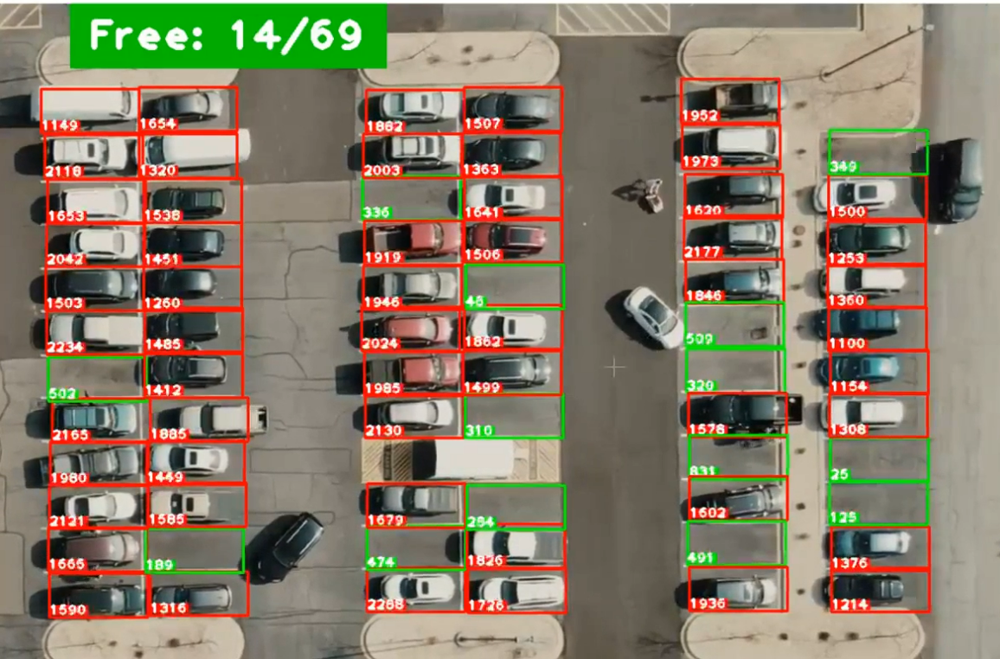

# Car Parking Space Counter

## Overview

This project is a computer vision application that detects and counts available parking spaces in a parking lot using video processing techniques. The system analyzes video footage from a parking area, identifies marked parking spots, and determines whether each spot is occupied or vacant in real-time.

## Features

- Real-time parking space monitoring
- Visual indicators for occupied and vacant spots
- Live counter displaying available parking spaces
- Easy setup for defining parking space locations

## Demo

Watch the system in action:

[Video](./demo.mp4)

Screenshot:



## Prerequisites

- Python 3.6 or higher
- OpenCV library
- CVZone library
- NumPy library
- Video footage of a parking lot (sample included: `carPark.mp4`)
- Reference image of the parking lot (sample included: `carParkImg.png`)

## Installation

1. Clone this repository:

   ```bash
   git clone https://github.com/BertrandConxy/Car-parking-space-counter.git
   cd car-parking-space-counter
   ```

2. Install the required dependencies:

   ```bash
   pip install -r requirements.txt
   ```

## Usage

### Step 1: Define Parking Spaces

Before running the main application, you need to define the parking spaces in your reference image:

```bash
python parkingSpacePicker.py
```

Instructions:

- Left-click to mark the top-left corner of each parking space
- Right-click to remove a marked space if placed incorrectly
- The marked spaces will be saved automatically to the `CarParkPos` file
- Stop the program once done

### Step 2: Run the Parking Space Counter

After defining all parking spaces, run the main application:

```bash
python main.py
```

The application will:

- Process the video feed
- Highlight available spaces in green and occupied spaces in red
- Display a count of available spaces in real-time

## How It Works

1. **Space Definition**: The `parkingSpacePicker.py` script allows users to define parking spaces by clicking on the reference image.

2. **Image Processing**: The main script applies several computer vision techniques:
   - Conversion to grayscale
   - Gaussian blur to reduce noise
   - Adaptive thresholding to identify objects
   - Median blur and dilation to refine object boundaries

3. **Space Analysis**: For each defined parking space, the system counts non-zero pixels after processing to determine occupancy.

4. **Visualization**: Results are displayed with color-coded rectangles and a real-time counter.

## Real-World Use Cases

### Smart City Infrastructure

- Integration with city traffic management systems
- Real-time parking availability data for navigation apps
- Reduction of traffic congestion in urban areas

### Commercial Parking Management

- Shopping malls and supermarkets can display available spaces to customers
- Parking fee optimization based on occupancy patterns
- Staff allocation optimization during peak hours

### Campus and Corporate Environments

- Efficient parking management for large corporate campuses
- University parking monitoring for students and faculty
- Event venue parking optimization

### Data Collection and Analysis

- Historical parking usage patterns for urban planning
- Peak hour identification for infrastructure development
- Optimization of parking lot design and layout

## Customization

You can customize various parameters in the code:

- Adjust the parking space dimensions by modifying the `width` and `height` variables
- Change the threshold value in the `checkParkingSpace()` function to adapt to different lighting conditions
- Modify visualization settings (colors, text size, etc.) as needed

## License

[MIT Licence](./LICENCE)

## Contributing

Contributions are welcome! Please feel free to submit a Pull Request.
